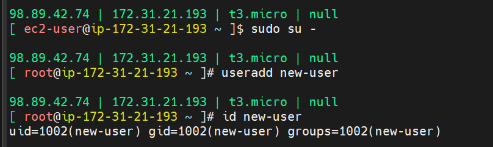
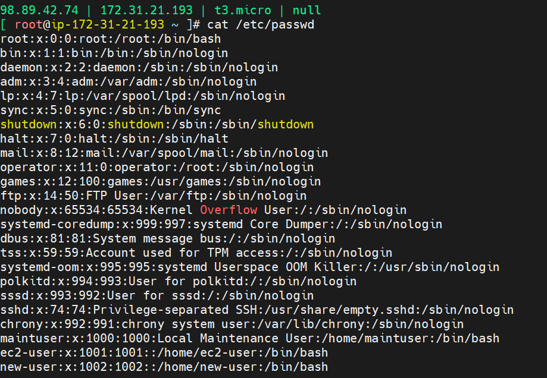
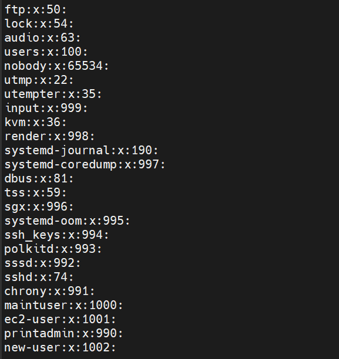
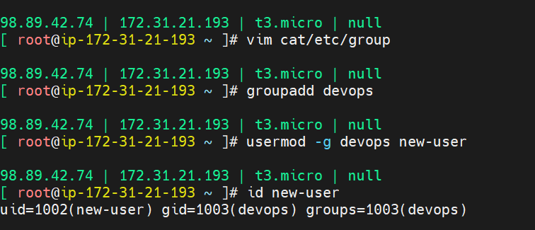
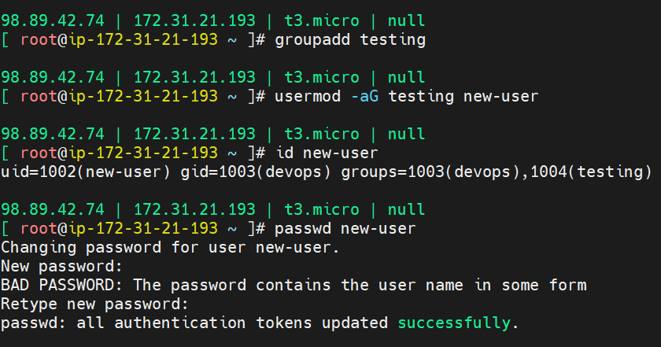
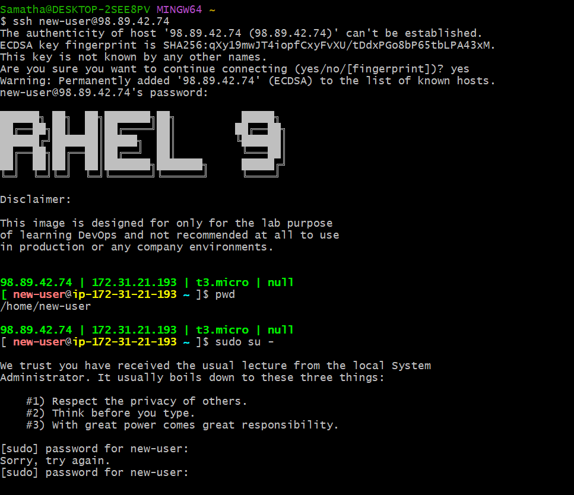
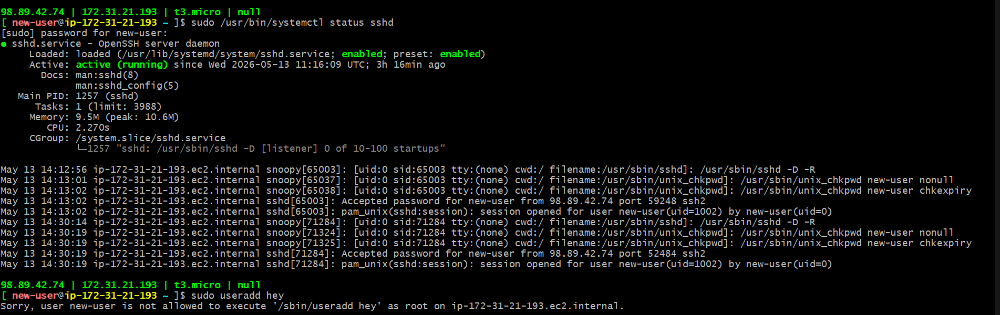

## Step 1: Create a New User

Create a new user using:

```bash
useradd new-user
```

---

## Verify User Details

Check the user information using:

```bash
id new-user
```

### Example Output

```bash
uid=1002(new-user) gid=1002(new-user) groups=1002(new-user)
```

---

## Understanding the Output

| Field | Meaning |
|---|---|
| `uid` | Unique User ID assigned to the user |
| `gid` | Primary Group ID of the user |
| `groups` | All groups the user belongs to |

---

## Primary & Secondary Groups

- Every Linux user has **one primary group**
- By default, Linux creates a group with the same name as the user
- A user can also belong to multiple **secondary groups** for additional permissions

Example:

```text
User: new-user
Primary Group: new-user
Secondary Groups: sudo, docker, developers
```

---

## Screenshot



## Step 2: View User Information from `/etc/passwd`

Display all user account details stored in the system using:

```bash
cat /etc/passwd
```

---

## Purpose of `/etc/passwd`

- `/etc/passwd` is a system file that stores user account information
- Each line represents one user in the system
- It contains details like:
  - Username
  - UID
  - GID
  - Home directory
  - Default shell

---

## Example Entry

```text
new-user:x:1002:1002::/home/new-user:/bin/bash
```

---

## Understanding the Fields

| Field | Meaning |
|---|---|
| `new-user` | Username |
| `x` | Password placeholder (actual password stored in `/etc/shadow`) |
| `1002` | User ID (UID) |
| `1002` | Group ID (GID) |
| `/home/new-user` | User home directory |
| `/bin/bash` | Default login shell |

---

## Screenshot



## Step 3: View Group Information from `/etc/group`

Display all group details stored in the system using:

```bash
cat /etc/group
```

---

## Purpose of `/etc/group`

- `/etc/group` stores information about all groups in the system
- Each line represents one group
- It contains:
  - Group name
  - Group ID (GID)
  - Users belonging to the group

---

## Example Entry

```text
new-user:x:1002:
```

---

## Understanding the Fields

| Field | Meaning |
|---|---|
| `new-user` | Group name |
| `x` | Password placeholder |
| `1002` | Group ID (GID) |
| *(empty)* | Users in the group |

---

## Notes

- When a new user is created, Linux usually creates a group with the same name
- Users can belong to multiple groups for permission management

---

## Screenshot



## Step 4: Create a New Group and Change User Primary Group

Create a new group using:

```bash
groupadd devops
```

---

## Change User Primary Group

Assign the `devops` group as the primary group for `new-user`:

```bash
usermod -g devops new-user
```

---

## Verify Updated User Details

Check the updated group information using:

```bash
id new-user
```

### Example Output

```bash
uid=1002(new-user) gid=1003(devops) groups=1003(devops)
```

---

## Understanding the Output

| Field | Meaning |
|---|---|
| `uid=1002(new-user)` | User ID of `new-user` |
| `gid=1003(devops)` | Primary group changed to `devops` |
| `groups=1003(devops)` | User currently belongs to `devops` group |

---

## Notes

- `groupadd` creates a new group in the system
- `usermod -g` changes the user's primary group
- After modification, newly created files by the user will belong to the `devops` group

---

## Screenshot



## Step 5: Add User to a Secondary Group and Set Password

Create a new secondary group using:

```bash
groupadd testing
```

---

## Add User to Secondary Group

Add `new-user` to the `testing` group without removing existing groups:

```bash
usermod -aG testing new-user
```

---

## Verify Updated Group Membership

Check the updated user details:

```bash
id new-user
```

### Example Output

```bash
uid=1002(new-user) gid=1003(devops) groups=1003(devops),1004(testing)
```

---

## Understanding the Output

| Field | Meaning |
|---|---|
| `uid=1002(new-user)` | User ID of `new-user` |
| `gid=1003(devops)` | Primary group is `devops` |
| `1004(testing)` | Secondary group added to the user |

---

## Notes

- `-g` → Changes primary group
- `-aG` → Adds user to secondary groups without removing existing groups
- A user can belong to multiple secondary groups

---

## Set Password for User

Assign a password to the user account:

```bash
passwd new-user
```

---

## Example Output

```text
Changing password for user new-user.
New password:
BAD PASSWORD: The password contains the user name in some form
Retype new password:
passwd: all authentication tokens updated successfully.
```

---

## Notes

- Linux warns if the password is weak or contains the username
- Even after the warning, the password can still be set successfully
- Strong passwords should include:
  - Uppercase letters
  - Lowercase letters
  - Numbers
  - Special characters

---

## Screenshot



## Step 6: Login with the New User Using SSH

Connect to the remote Linux server using the newly created user:

```bash
ssh new-user@98.89.42.74
```

---

## First-Time SSH Connection Warning

During the first connection, SSH displays the server fingerprint:

```text
The authenticity of host '98.89.42.74' can't be established.
Are you sure you want to continue connecting (yes/no/[fingerprint])?
```

Type:

```text
yes
```

This adds the server fingerprint to the local `known_hosts` file for future trusted connections.

---

## Verify Current User and Home Directory

Check the current working directory after login:

```bash
pwd
```

### Example Output

```bash
/home/new-user
```

---

## Understanding the Output

| Command | Purpose |
|---|---|
| `ssh` | Connects to a remote Linux server securely |
| `pwd` | Displays the current working directory |
| `/home/new-user` | Default home directory of the user |

---

## Attempt to Switch to Root User

Try switching to the root user using:

```bash
sudo su -
```

---

## Example Output

```text
We trust you have received the usual lecture from the local System Administrator.

[sudo] password for new-user:
Sorry, try again.
```

---

## Notes

- `sudo` allows a normal user to execute administrative commands
- The password requested is the password of `new-user`
- `Sorry, try again.` appears when an incorrect password is entered
- A user must belong to the `sudo` group to gain administrative privileges

---

## Screenshot



## Step 7: Grant Sudo Access to the User

The `new-user` was unable to execute `sudo` commands because it was not part of the administrative group.

Add the user to the `wheel` group using:

```bash
usermod -aG wheel new-user
```

---

## Purpose of the `wheel` Group

- The `wheel` group is used to provide sudo privileges in many Linux distributions
- Users added to this group can execute administrative commands using `sudo`

---

## Verify Group Membership

Check whether the user has been added to the `wheel` group:

```bash
id new-user
```

### Example Output

```bash
uid=1002(new-user) gid=1003(devops) groups=1003(devops),1004(testing),10(wheel)
```

---

## Important Note

After modifying group memberships, the user must logout and login again for the changes to take effect.

Reconnect using SSH:

```bash
ssh new-user@98.89.42.74
```

---

## Verify Sudo Access

After re-login, try switching to the root user again:

```bash
sudo su -
```

If the password is entered correctly, the user will gain root access successfully.

---

## Notes

- `-aG` → Adds the user to additional groups without removing existing groups
- Group membership changes apply only after a fresh login session
- `wheel` group users can perform administrative tasks using `sudo`

---

## Step 8: Grant Permission for a Specific Command Only

Instead of giving full sudo access, Linux also allows granting permission for only specific commands.

Open the sudoers file safely using:

```bash
visudo
```

---

## Add Command-Specific Permission

Inside the file, add the following line:

```text
new-user ALL=(ALL) /usr/bin/systemctl
```

---

## Meaning of the Rule

| Part | Description |
|---|---|
| `new-user` | User receiving the permission |
| `ALL` | Rule applies from any host |
| `(ALL)` | User can run the command as any user |
| `/usr/bin/systemctl` | Only this command is allowed with sudo |

---

## Result

Now the user can execute:

```bash
sudo systemctl
```

But other sudo commands will not work.

Example:

```bash
sudo yum update
```

Output:

```text
Sorry, user new-user is not allowed to execute '/usr/bin/yum update'
```

---

## Notes

- This method provides restricted administrative access
- Useful when users should manage only specific services or commands
- `visudo` is safer than editing `/etc/sudoers` directly using `vim`

### Why `visudo` is Better than `vim /etc/sudoers`

| `visudo` | `vim /etc/sudoers` |
|---|---|
| Performs syntax checking before saving | No syntax validation |
| Prevents multiple users editing simultaneously | No locking protection |
| Reduces risk of sudo configuration errors | Wrong syntax may break sudo access |

If incorrect syntax is added directly using `vim`, sudo may stop working completely.

---

## Screenshot

